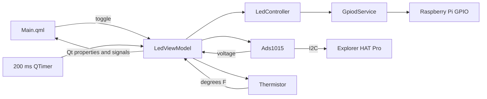

# Pi Panel Architecture

Pi Panel is a Qt Quick application that controls Raspberry Pi GPIO and reads an analog thermistor through a Pimoroni Explorer HAT Pro. The executable is built with CMake and uses C++ for hardware access and application state, with QML for the window.

## Component overview

| Component | Responsibility |
|---|---|
| `main.cpp` | Creates the application, hardware services, view model, and polling timers |
| `Controllers/GpiodService` | Reads and writes Raspberry Pi GPIO lines through `libgpiod` |
| `Controllers/LedController` | Owns LED state and translates LED/button operations into GPIO calls |
| `Controllers/Ads1015` | Reads Explorer HAT Pro analog channels over Linux I2C |
| `Controllers/Thermistor` | Converts divider voltage into degrees Fahrenheit |
| `ViewModels/LedViewModel` | Exposes LED, voltage, temperature, and error state to QML |
| `Main.qml` | Displays the LED control, measured voltage, temperature, and errors |

## Runtime data flow



The analog timer calls `LedViewModel::sampleAnalogInput()` every 200 ms. The view model first reads ADC channel 3, which is Explorer HAT Pro Analog 1, and then passes that voltage to the thermistor conversion. Qt property notification signals cause QML labels to refresh.

The 5 ms GPIO timer currently handles shutdown signals. Its physical-button polling block is present but commented out in `main.cpp`, so the physical button does not currently toggle the LED. The QML button does call `LedViewModel::toggle()` and controls the real LED.

## Error handling

Hardware exceptions are caught at the view-model boundary:

- LED errors emit `operationFailed`.
- ADC errors set `analogAvailable` to false and expose `analogError`.
- Conversion errors set `temperatureAvailable` to false and expose `temperatureError`.

An ADC or thermistor error is shown in the window and does not stop LED control.

## Build and test

```bash
cmake -S . -B build -DCMAKE_BUILD_TYPE=Debug
cmake --build build --config Debug
ctest --test-dir build --output-on-failure
```

## Feature documentation

- [LED control](led.md)
- [Thermistor and temperature](thermistor.md)

General setup, I2C configuration, and display-launch instructions remain in the project root `readme.md`.